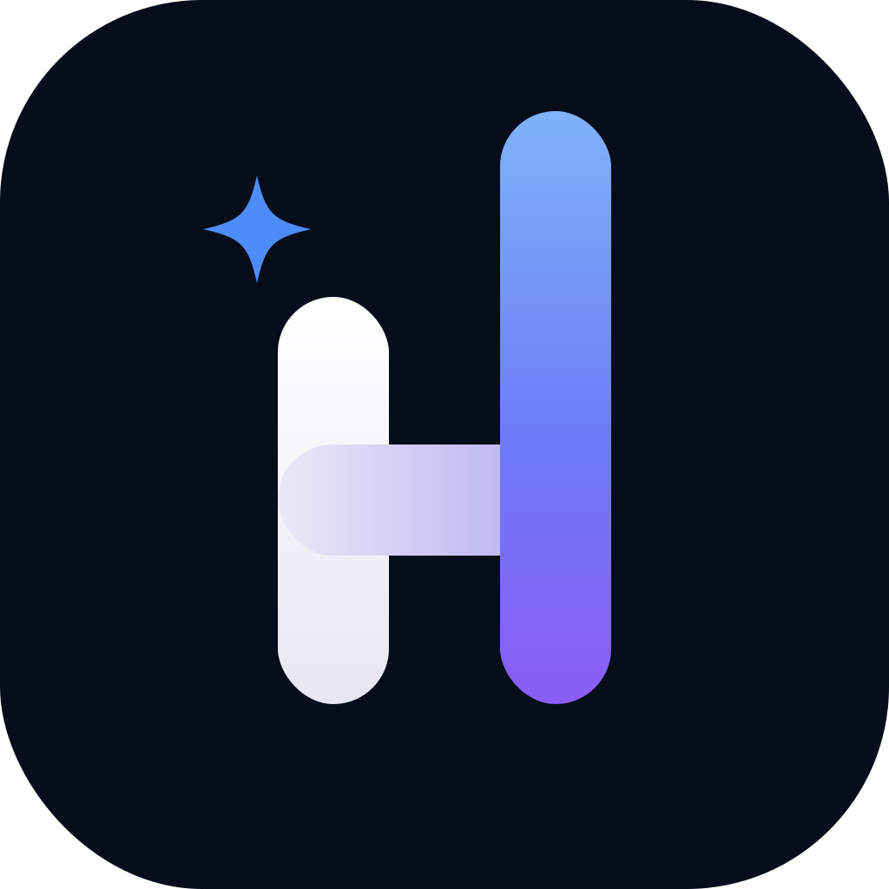
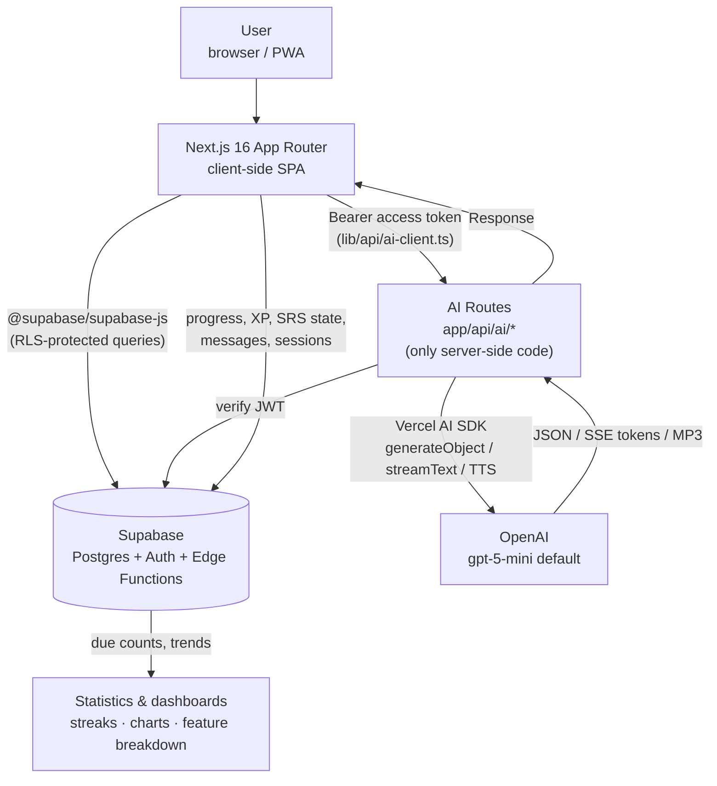
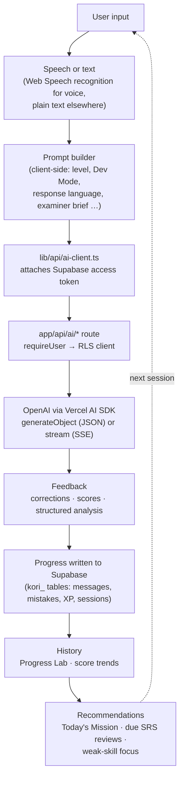
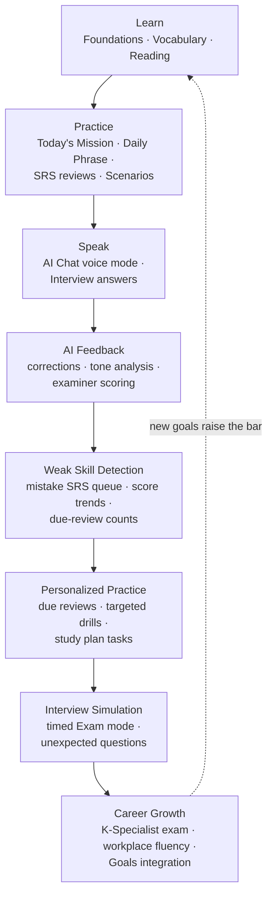
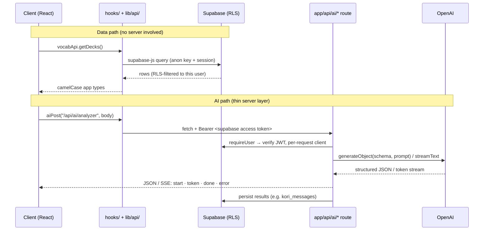

<div align="center">



# Hengo

**An AI-powered Korean learning platform for software engineers and international professionals working in Korea.**

[](package.json)
[](#18-license)
[](https://nextjs.org)
[](https://react.dev)
[](https://www.typescriptlang.org)
[](https://supabase.com)
[](https://platform.openai.com)
[](https://tailwindcss.com)

[Why Hengo](#2-why-hengo-exists) · [Features](#4-key-features) · [Architecture](#6-product-architecture) · [K-Specialist Interview](#9-k-specialist-interview-module) · [Development Guide](#13-development-guide) · [Roadmap](#16-roadmap)

</div>

---

## Table of Contents

1. [Hero](#hengo)
2. [Why Hengo Exists](#2-why-hengo-exists)
3. [Product Vision](#3-product-vision)
4. [Key Features](#4-key-features)
5. [Screenshots](#5-screenshots)
6. [Product Architecture](#6-product-architecture)
7. [AI Workflow](#7-ai-workflow)
8. [Learning Journey](#8-learning-journey)
9. [K-Specialist Interview Module](#9-k-specialist-interview-module)
10. [Technology Stack](#10-technology-stack)
11. [Project Structure](#11-project-structure)
12. [Application Architecture](#12-application-architecture)
13. [Development Guide](#13-development-guide)
14. [Design System](#14-design-system)
15. [Performance](#15-performance)
16. [Roadmap](#16-roadmap)
17. [Contributing](#17-contributing)
18. [License](#18-license)
19. [Author](#19-author)

---

## 2. Why Hengo Exists

### The problem

Generic Korean learning apps teach you to order coffee. They do not teach you to:

- explain a production incident to a Korean teammate,
- decode the politeness level of a manager's Kakao message,
- survive a spoken K-Specialist visa interview,
- or write a status update in workplace-appropriate Korean.

Foreign software engineers in Korea live in a very specific language gap: fluent enough in English to do the job, but blocked daily by **workplace and technical Korean** — the register no textbook covers.

### Who it is built for

- Software engineers working (or planning to work) in Korea
- Foreign professionals navigating Korean workplace communication
- K-Specialist visa candidates preparing for the spoken exam
- Learners who want AI-assisted, feedback-driven study instead of static lessons

### The philosophy: learning by doing

Hengo is built around one belief: **you learn a language by using it under realistic pressure, with immediate feedback** — not by completing lesson N+1.

Every feature closes the same loop:

1. **Do something real** — hold a conversation, answer an interview question, decode an actual message you received.
2. **Get AI feedback** — corrections, tone analysis, better alternatives.
3. **Turn mistakes into study material** — errors flow into a spaced-repetition review queue automatically.
4. **Repeat with harder material** — the app surfaces what is due and what is weak.

Existing apps stop at step 1. Hengo is the loop.

---

## 3. Product Vision

Hengo is not only a Korean app. It is an **AI learning and growth platform** whose first vertical is Korean for professionals — the same engine (AI conversation, structured feedback, spaced repetition, goal tracking, progress analytics) generalizes to any skill you practice through language.

Today it already combines what would normally be six separate apps:

| Pillar | What Hengo does |
|---|---|
| Language tutor | AI conversation, vocabulary SRS, reading, listening, foundations |
| Interview coach | Full K-Specialist mock interview simulator with scoring |
| Workplace assistant | Message analyzer and generator for real Korean workplace communication |
| Productivity system | Goals, tasks, calendar, and an AI goal coach |
| Progress tracker | Dashboard, streaks, XP/achievements, history, weak-skill detection |
| Personal growth platform | Habits (Growth workspace) — identity-based habit streaks and domain-neutral behavior-change support (Recovery) |

The long-term direction extends the same platform into:

- **AI mentor** — a persistent coach that knows your history, level, and goals
- **AI interview coach** — beyond K-Specialist: job interviews, performance reviews
- **Career coach** — long-term growth planning tied to the goals system
- **Personalized learning** — study plans generated from measured weaknesses, not fixed curricula
- **Workplace assistant** — deeper integration with the messages, documents, and meetings of a real Korean job

---

## 4. Key Features

Features are grouped into six product areas. All routes live under `app/(main)/` unless noted.

### AI Learning

The unified **AI Coach** workspace at `/chat` has four tabs, all backed by the `app/api/ai/*` routes:

| Feature | Purpose | Benefits | Main technologies |
|---|---|---|---|
| **AI Chat** | Free Korean conversation with an AI partner | "Dev Mode" for technical Korean, Korean voice mode, response-language control; conversation is the core practice surface | SSE streaming (`chat/stream`), Vercel AI SDK, messages persisted to `kori_messages` |
| **Message Analyzer** | Decode a real Korean message you received | Explains tone, politeness level, hidden nuance, and suggests replies — workplace survival tool | `analyzer` route, `generateObject` + Zod schema |
| **Message Generator** | Turn an English intent into Korean | Produces the same message across formality levels so you pick the right register | `message-generator` route, structured JSON output |
| **AI Goal Coach** | Streamed coaching on your goals | Suggests concrete tasks and plans inside the Goals feature | `goals/coach` (SSE) and `goals/generate-tasks` |
| **Corrections (SRS)** | Review your past mistakes | Every correction becomes a flashcard graded Again/Hard/Good/Easy — mistakes are the syllabus | `corrections/check` route, custom SRS engine in `lib/srs.ts` |

### Korean Learning

| Feature | Route | Purpose | Benefits | Main technologies |
|---|---|---|---|---|
| **Foundations** | `/learn`, `/learn/[lessonId]` | Absolute-beginner Korean: Survival / Alphabet / Grammar tracks | Structured on-ramp before the AI-driven features | Per-lesson runner, Supabase-backed progress |
| **Vocabulary** | `/vocab` | Spaced-repetition decks with AI generation, import, and challenges | AI builds decks for your level; dictionary lookup; sentence challenges force production, not just recognition | SRS (`lib/srs.ts`, `lib/vocab-review.ts`), `vocab/{generate,lookup,check-sentence,sentence-challenge}` routes, `es-hangul` |
| **Reading** | `/reading` | Multi-unit reading practice | Tap-to-translate, audio playback, comprehension quizzes | `lib/reading.ts`, TTS route |
| **Listening** | `/listening` | AI-generated listening passages | Slow/normal playback, transcript, quiz — part of the Learning workspace nav | `listening/generate` route, TTS |
| **Daily Practice / Today** | `/practice` | The home surface: "Today's Mission" checklist | One place showing vocab due, daily phrase, mistakes due, and scenario practice, mixed for your level | `daily-phrase/{generate,practice,check-practice}` routes |

> `/daily-phrase` redirects to `/practice` and `/mistakes` redirects to the Corrections tab in AI Coach — both were merged into larger surfaces, and the redirect stubs are kept deliberately so old bookmarks still work.

### Speaking

| Feature | Route | Purpose | Benefits | Main technologies |
|---|---|---|---|---|
| **Exam Prep (Interview)** | `/interview` | Full K-Specialist mock interview simulator | See the [dedicated section below](#9-k-specialist-interview-module) | `chat/stream` with examiner prompts, Web Speech recognition, TTS |
| **Script Writer** | `/interview/script` | Write and rehearse the 7-section exam script | Autosaves locally, syncs to your account, separate Q&A prep tab | `lib/api/interview.ts`, Supabase persistence |
| **Scenarios** | `/scenarios` | Roleplay prompts for real-life and workplace situations | Launches a guided AI conversation in Chat with the scenario as context | Chat streaming with scenario prompts |

### Productivity

| Feature | Route | Purpose | Benefits | Main technologies |
|---|---|---|---|---|
| **Goals** | `/goals` | Plan goals, track deadlines, manage tasks, calendar view | Tasks that name a learning feature get a "Practice →" deep link (`lib/learning-task-link.ts`), and a goal can **auto-track a live learning metric** (vocab saved, corrections logged, foundation lessons, feature sessions — daily/weekly/all-time) via `metadata.learning_metric` (`components/goals/LearningMetricCard.tsx`) instead of a manual checklist — productivity and learning are one system | Reuses Orbit's `goals`/`tasks` tables and RPCs, `progressApi.getMetricCount`, AI Goal Coach streaming |
| **Dashboard** | `/dashboard` | Productivity command center | Goals overview, today's tasks, upcoming deadlines, and a roadmap teaser — one place to see what needs you today | TanStack Query |
| **Dev Notes** | `/notes`, `/notes/new`, `/notes/[slug]` | Personal knowledge library (Java/Spring/SQL/etc.) | Search + markdown editor; reachable from Settings, not the main nav | `marked`, Supabase |
| **Roadmap** | `/roadmap` | Learning roadmap with study sections/milestones | Customizable sections persisted locally | Local persistence |

### Progress

| Feature | Route | Purpose | Benefits | Main technologies |
|---|---|---|---|---|
| **History (Progress Lab)** | `/history` | Past study sessions and attempts across features | See what you actually did, not what you planned | Supabase, `lib/api/progress.ts` |
| **Achievements** | `/achievements` | XP, levels, skill badges | A compact level/XP badge (`components/achievements/LevelBadge.tsx`) sits in the desktop and mobile top bars on every page | Supabase-backed XP model |
| **Statistics** | `/statistics` | One analytics view for the whole platform | Streak, weekly minutes, XP, weekly progress chart, and a per-feature time breakdown across Learning and Productivity | Recharts, `lib/api/progress.ts` |

### Growth

A separate workspace for personal behavior-change, distinct from the language-learning pillars above. Two features are shipped; four are placeholders (`soon` flag in `lib/navigation.ts`, disabled nav entries).

| Feature | Route | Purpose | Benefits | Main technologies |
|---|---|---|---|---|
| **Habits** | `/growth/habits`, `/growth/habits/[id]` | Generic daily habit tracking (exercise, reading, meditation, sleep, water, study, coding, deep work, walking, or a custom category) | Simple daily check-off with current streak, longest streak, and consistency % | `lib/habits.ts` (pure, calendar-date streak math), `lib/api/habits.ts` |
| **Recovery** | `/growth/recovery` (+ `log`, `pause`, `debrief`, `plans`, `triggers`, `checkins`) | Support for urges and compulsive patterns: logging a moment, a guided breathing pause, a calm post-slip debrief, and spaced-repetition if-then plans | **Domain-neutral by design** — no specific behavior is ever named in code, copy, or commit history; habit labels are user-entered free text only. Live elapsed-time clock; full CRUD on habits, triggers, check-ins, and plans | `lib/recovery.ts` (SRS-adapted plan scheduling via `lib/srs.ts`, KST-aware day boundaries), `lib/api/recovery.ts` |
| Deep Work · Mood · Journal · Rewards | `/growth/focus`, `/growth/mood`, `/growth/journal`, `/growth/rewards` | Planned: focus sessions, mood tracking, journaling, milestone rewards | — | — |

> Recovery's underlying Supabase tables are still named `kori_focus_*` — they pre-date the Growth-workspace rename and hold live user data, so a table rename wasn't worth the migration risk. App-facing code and types use `Recovery*` naming throughout (`lib/api/recovery.ts` maps between them).

### App surfaces

| Surface | Route | Notes |
|---|---|---|
| Landing page | `/` | Marketing/intro page — feature highlights, links to Login/Register. GSAP + Lenis scroll animations |
| Home (workspace gate) | `/home` | Immersive "pick a lane" screen — three poster cards (**Korean Learning**, **Goal Setting**, and **Your Progress**) with live stats; rendered with no sidebar, top bar, or tabs. Each card deep-links to the last route you visited in that workspace (`lib/last-visited.ts`) |
| Login / Register | `/login`, `/register` | Supabase auth — email/password + Google sign-in (route group `(auth)`) |
| Settings | `/settings` | Profile, Korean level, work context, model preference, avatar. `/account` is an alias for the same page |

### Navigation

- **One nav source.** `lib/navigation.ts` defines five **workspaces** — `Learning` (Today · Vocabulary · Foundations · Reading · Listening · Scenarios · Exam Prep), `Productivity` (Dashboard · Goals · Roadmap · Notes), `AI` (Chat · Analyze · Generate · Corrections), `Progress` (Achievements · Statistics · History), `Growth` (Habits · Recovery · Deep Work/Mood/Journal/Rewards, the last four `soon`). The sidebar, mobile bottom bar, and "More" sheet all render from it — adding a module later means adding one workspace entry, not touching the shell. A `soon` flag on a link renders it as a disabled "Soon" entry.
- **Home gate.** `/home` is the workspace gate: it renders without any app chrome (no sidebar, top bars, or tabs). The Learning, Productivity, and Progress poster cards deep-link to the last route you visited in that workspace (`lib/last-visited.ts`); the Growth card links to a fixed `/growth/habits` since `WorkspaceId` there still only covers `learning`/`productivity`/`progress` (same pre-existing gap as `ai`, noted in `lib/navigation.ts`).
- **Desktop:** a contextual sidebar in `app/(main)/layout.tsx` — an icon-only workspace-switcher row on top, then only the active workspace's links below it (`getWorkspaceForPath`), so the sidebar shows one workspace at a time.
- **Header:** a compact level/XP badge sits in both the desktop and mobile top bars, linking to `/achievements`.
- **Mobile:** a bottom tab bar — Home · Learn (Today) · Plan (Goals) · AI (Chat) — with a "More" sheet exposing the remaining links grouped by workspace so nothing is unreachable on a phone.
- **Immersive routes:** on `/chat` and `/home` the mobile header, bottom tabs, and content padding are removed for a full-bleed experience. If you touch chat layout, check the shell's `isChatRoute` / `isHomeRoute` branches and `components/chat/ChatWindow.tsx`.

---

## 5. Screenshots

> Screenshots are pending. Place images under `docs/screenshots/` and replace the placeholders below.

| Screen | Preview |
|---|---|
| Dashboard | `` |
| Vocabulary | `` |
| Interview (Exam Prep) | `` |
| AI Coach | `` |
| Goals | `` |
| Reading | `` |
| Settings | `` |

---

## 6. Product Architecture

Hengo is a **client-side SPA over Supabase, plus a thin set of Next.js AI routes**. The former Spring Boot backend was replaced in July 2026: data and auth now live in Supabase, and the AI features run in `app/api/ai/*` route handlers — the only server-side code in the app.



### Layer responsibilities

| Layer | Responsibility |
|---|---|
| **User / Browser** | All UI state, routing, and most business logic run client-side. The route guard is client-side only: `app/(main)/layout.tsx` redirects unauthenticated users to `/login`. |
| **Next.js SPA** | App shell, feature pages, hooks. Talks to exactly two backends: Supabase directly (data) and `app/api/ai/*` (AI). |
| **Supabase** | Postgres data, auth (email/password + Google), Row Level Security on every table, and the `kori-send-push` Edge Function for web push. Shared project with Orbit/DailyGoalMap: Hengo-owned tables are prefixed `kori_`; the goals/tasks domain reuses Orbit's original tables (`goals`, `tasks`, …) and RPCs. |
| **AI Routes** | Thin server handlers: verify the caller's Supabase JWT, build the prompt, call OpenAI via the Vercel AI SDK, return JSON or an SSE stream. No service key anywhere — each request gets a per-request Supabase client so **RLS applies on the server too**. |
| **OpenAI** | Chat/structured generation (default `gpt-5-mini`, override with `AI_MODEL`) and audio TTS (proxied, returns MP3 bytes). |
| **Progress → Statistics** | Every activity writes progress rows back to Supabase; `/statistics` and the workspace dashboards aggregate them into streaks, weekly charts, due counts, and a per-feature time breakdown. |

---

## 7. AI Workflow

Every AI feature follows the same request lifecycle:



### Stage by stage

1. **Speech / Text** — voice features (Korean voice mode in Chat, interview answers) use browser speech recognition; everything else is typed. Audio *output* comes from the `tts` route.
2. **Prompt builder** — prompts are assembled client-side. Notably, `useChat` injects response-language and "Dev Mode" (technical Korean) instructions into the outgoing message text rather than via API parameters, and the interview builds a full examiner brief (`lib/interview.ts`) including sampled unexpected questions.
3. **Auth + transport** — `aiPost`/`authHeaders` (`lib/api/ai-client.ts`) attach the Supabase access token; `lib/api/sse.ts` parses streams.
4. **AI route** — `requireUser` verifies the JWT; `jsonAiRoute` pairs a Zod schema with the prompt and calls `generateObject` for structured JSON. Streaming routes (`chat/stream`, `goals/coach`) keep the same SSE event protocol the Spring backend used: `start` / `token` / `done` / `error`.
5. **Feedback** — corrections, tone analysis, examiner feedback, or graded answers come back typed (Zod-validated).
6. **Progress** — results persist: `chat/stream` writes both message rows to `kori_messages`; mistakes enter the SRS queue; interview sessions record scores.
7. **History → Recommendations** — accumulated history feeds the score trends, streaks, and the Statistics breakdown; due SRS reviews and the Today's Mission checklist decide what you should do next.

### AI endpoints

All fifteen route handlers under `app/api/ai/`:

`analyzer` · `chat/stream` · `corrections/check` · `daily-phrase/generate` · `daily-phrase/practice` · `daily-phrase/check-practice` · `goals/coach` · `goals/generate-tasks` · `listening/generate` · `message-generator` · `tts` · `vocab/generate` · `vocab/lookup` · `vocab/check-sentence` · `vocab/sentence-challenge`

---

## 8. Learning Journey

The platform is designed as a single progression loop, not a menu of disconnected tools:



How users move through it:

- **Learn → Practice.** Foundations and vocabulary decks feed the daily practice surface (`/practice`), which assembles "Today's Mission" from what is actually due.
- **Practice → Speak.** Scenarios and the AI Coach push learners from recognition into production — typing and then speaking Korean.
- **Speak → Feedback → Weakness.** Every production attempt gets AI feedback, and every mistake becomes an SRS card. The system detects weakness from evidence (due counts, score trends), not self-assessment.
- **Weakness → Personalized practice.** The Today's Mission checklist, learning-metric goals, and the interview study plan convert detected weaknesses into concrete next actions with deep links.
- **Simulation → Career.** The K-Specialist exam simulation is the current capstone; the Goals system ties language milestones to real career outcomes, and completing them starts the loop again at a higher level.

---

## 9. K-Specialist Interview Module

The Exam Prep module (`/interview`) is Hengo's flagship feature, designed around the **real K-Specialist spoken exam process** — a live spoken Q&A judged on four criteria: **Speaking, Pronunciation, Vocabulary, and Confidence** (scored out of 5 each). The module's design is documented in `components/interview/README.md`; the live data lives in `lib/study-plan.ts`, `lib/interview.ts`, and `lib/exam-strategy.ts`.

### What it includes

**Mock interviews with an AI examiner.** An AI examiner asks one question at a time; you answer by voice (speech recognition) or typed text. The examiner turn streams over the same SSE channel as chat, with an examiner brief built in `lib/interview.ts`.

**Two modes, one page.** `lib/interview-modes.ts` defines a single flag object that drives both the examiner prompts and the session UI — Practice and Exam are the same page behaving differently:

| | Practice mode | Exam mode |
|---|---|---|
| Per-turn feedback | After every answer | Held until the end |
| English translations | On demand | Off |
| Slow (0.75×) TTS replay | Yes | No |
| Study Pack visible in session | Yes | No |
| Timer | Untimed | Whole-interview countdown |
| Unexpected questions | Fewer | More |

**Dynamic follow-up questions.** The examiner reacts to your actual answer rather than reading a fixed list — each turn is generated in context.

**Unexpected questions.** Real K-Specialist interviewers break from the prepared topic to test spontaneous Korean. `lib/interview-unexpected.ts` maintains a curated pool of everyday off-topic questions (life in Korea, work, hometown, hobbies, food, plans, study); each session samples a few into the examiner brief with an instruction to adapt the wording naturally — variety comes from sampling plus the model's paraphrasing, with no extra AI round-trip.

**Scoring against the real criteria.** Finishing a session produces a scorecard against the four exam criteria. Pronunciation and confidence values are **estimated from the speech-recognition transcript** — there is no audio-signal analysis yet (see [Roadmap](#16-roadmap)).

**Weak skill detection.** Scores build a trend over time (`components/interview/ScoreTrend.tsx`, `lib/interview-history.ts`), showing which criterion lags and whether drilling is working.

**Exam simulation.** Timed Exam mode with no English, no study pack, and end-only feedback reproduces real exam conditions.

**Script writer** (`/interview/script`). A Google-Docs-style editor for the seven-section exam script (greeting, topic intro, comparison, daily life, health effects, reflection, conclusion) with Korean draft + English translation per section. It autosaves locally and syncs to your account, and has a separate tab for drafting answers to likely Q&A questions.

**Study Pack and strategy.** Topic vocabulary, key phrases, and likely questions — each with TTS playback — plus a Speaking Strategy card (short answers first, slow speaking, safety sentences, show growth) available as a quick reference during a live session.

**Study plan.** An 11-week phased plan (baseline → foundation → speaking → polish → taper) rendered by `StudyPlanCard` with a live countdown (`ExamCountdownBanner`); task check-off state persists per device.

> This module is inspired by real interview requirements — the exam format, judging criteria, script process, and question style all mirror the actual K-Specialist spoken exam.

---

## 10. Technology Stack

| Category | Technology | Why it was chosen |
|---|---|---|
| **Frontend framework** | [Next.js 16](https://nextjs.org) (App Router) + [React 19](https://react.dev) | One framework hosts both the SPA and the AI route handlers — no separate backend to deploy. Route groups cleanly split `(auth)` from `(main)`. |
| | [TypeScript 5](https://www.typescriptlang.org) | End-to-end typing from Supabase row mapping to Zod-validated AI responses. |
| **Styling** | [Tailwind CSS v4](https://tailwindcss.com) | CSS-based config in `app/globals.css` (no `tailwind.config`); design tokens live next to the styles. |
| | [shadcn/ui](https://ui.shadcn.com) + [Radix UI](https://www.radix-ui.com) | Owned, editable primitives (`components/ui/*`) with Radix accessibility underneath — no styling lock-in. |
| **AI** | [Vercel AI SDK](https://sdk.vercel.ai) (`ai` + `@ai-sdk/openai`) | `generateObject` + Zod gives typed, validated AI output; streaming helpers map cleanly onto the app's SSE protocol. |
| | [OpenAI](https://platform.openai.com) | Default model `gpt-5-mini` (override with `AI_MODEL`); audio API for TTS (`TTS_MODEL`). |
| **Database** | [Supabase](https://supabase.com) Postgres | Managed Postgres with Row Level Security replaces an entire CRUD backend — the client queries directly and RLS enforces ownership. |
| **Authentication** | Supabase Auth | Email/password plus Google via `signInWithIdToken` (`lib/google-auth.ts`). Fixed storage key `koriai-auth` lets `lib/auth-store.ts` read the user id synchronously. |
| **Data state** | [TanStack Query](https://tanstack.com/query) | Global provider (staleTime 60 s, no refetch on focus) for server-state caching. Some hooks (`useChat`, parts of others) still manage state manually with `useState` + direct api calls. |
| **Forms & validation** | [React Hook Form](https://react-hook-form.com) + [Zod](https://zod.dev) (`@hookform/resolvers`) | Uncontrolled-input performance with one schema language shared between forms and AI route validation. |
| **Charts** | [Recharts](https://recharts.org) | Dashboard progress charts and interview score trends. |
| **Animation** | [Motion](https://motion.dev) (`motion/react`) | Declarative UI animation across the app. |
| | [GSAP](https://gsap.com) + [Lenis](https://lenis.darkroom.engineering) | Scroll-driven animation and smooth scrolling — landing page only. |
| **UI utilities** | `lucide-react` (icons) · `sonner` (toasts) · `next-themes` (dark mode) · `class-variance-authority` + `clsx` + `tailwind-merge` (variants) · `tw-animate-css` | The standard shadcn/ui ecosystem. |
| **Domain utilities** | `es-hangul` (Korean text handling) · `date-fns` (dates) · `marked` (notes markdown) | Small, focused libraries over frameworks. |
| **Monitoring** | [Sentry](https://sentry.io) (`@sentry/nextjs`) | Installed as a dependency but not yet wired up (no config, no `instrumentation.ts`, no imports). |
| **Testing** | [Vitest](https://vitest.dev) + Testing Library + jsdom | Fast unit tests colocated with the logic they test (`lib/*.test.ts`). `@playwright/test` is installed for future end-to-end coverage. |
| **Developer tools** | ESLint 9 (`eslint-config-next`, `@tanstack/eslint-plugin-query`) · pnpm | Linting includes TanStack Query correctness rules. |
| **Deployment** | [Vercel](https://vercel.com) | One deployment hosts the SPA and the AI routes; Supabase is the only external service. |

---

## 11. Project Structure

```text
app/
  (auth)/          login, register
  (main)/          app shell + every feature page
    layout.tsx     contextual sidebar, mobile tabs, immersive chat/home handling
    home/          workspace gate — Learning / Productivity poster cards
    chat/          AI Coach (Chat / Analyze / Generate / Corrections tabs)
    practice/      Today — Daily Practice Hub
    goals/  dashboard/  achievements/  statistics/  vocab/  reading/  listening/
    interview/     Exam Prep (+ interview/script — script writer)
    learn/         Foundations (Survival / Alphabet / Grammar lessons)
    scenarios/     Roleplay Scenarios
    roadmap/       Learning Roadmap
    history/       Progress Lab
    notes/         Dev Notes (knowledge library), notes/new, notes/[slug]
    settings/      Settings (account/ is an alias)
    growth/        Growth workspace — habits/, habits/[id]/, recovery/ (+ log, pause,
                   debrief, plans, triggers, checkins)
    mistakes/  daily-phrase/  focus/*  redirect stubs — keep them
                   (focus/* redirects to growth/recovery/* from the pre-rename routes)
  api/ai/          AI route handlers (the only server-side code)
components/
  ui/              reusable shadcn-style primitives (keep generic)
  chat/  ai/  vocab/  goals/  calendar/  reading/  dashboard/  learn/
  interview/  notes/  achievements/  recovery/  habits/  providers/  ...
hooks/             useChat, useVocab, useFoundations, useGoals, useNotes, etc.
lib/
  api/             Supabase integration — per-domain service package (barrel: index.ts)
                   (includes recovery.ts, habits.ts for the Growth workspace)
  server/ai.ts     shared plumbing for app/api/ai/* (requireUser, jsonAiRoute, SSE)
  supabase.ts      single browser Supabase client
  auth-store.ts    reads the persisted session (storage key "koriai-auth")
  navigation.ts    single source of truth for the five nav workspaces
  last-visited.ts  per-workspace "continue where you left off" tracking
  goals.ts  reading.ts  vocab-review.ts  srs.ts  study-plan.ts
  recovery.ts  habits.ts   pure logic for the Growth workspace (framework-free, tested)
  interview.ts  interview-modes.ts  interview-unexpected.ts
  interview-history.ts  exam-strategy.ts  ...
public/            hengo-icon.svg, sw.js (web push service worker), static assets
```

### Responsibilities and design principles

| Folder | Responsibility | Rule |
|---|---|---|
| `app/(main)/*` | One folder per feature page; `layout.tsx` is the entire app shell | Pages compose feature components; heavy logic goes to `lib/` or `hooks/` |
| `app/api/ai/*` | The only server-side code | Every route goes through `lib/server/ai.ts` helpers — never bypass `requireUser` |
| `components/ui/*` | shadcn-style reusable primitives | **Keep them generic.** Feature-specific components live in `components/<feature>/` |
| `components/<feature>/` | Feature components | Owned by the feature; may import from `ui/` but not from other feature folders |
| `hooks/` | Data-fetching and stateful logic per domain | Prefer TanStack Query; hooks call `lib/api/*`, never Supabase directly |
| `lib/api/` | **The single integration point** with Supabase | Per-domain files map snake_case rows to camelCase app types. Add new backend calls to the matching domain file, not inline in components. Import from the barrel: `import { vocabApi, getApiErrorMessage } from "@/lib/api"` |
| `lib/` (root) | Pure domain logic (SRS math, interview prompts, study plans) | Framework-free where possible — this is what the unit tests cover |

Other repo notes:

- Path alias `@/*` maps to the repo root.
- `dev-learning-notes/` is an unrelated embedded side project (own README/CLAUDE.md) — not part of the app; don't wire it in.
- `GuideLineNew.md` holds the full product vision and module list; `STUDY-PLAN.md`, `FOUNDATIONS_BACKEND.md`, `INTEGRATION.md` are working docs (INTEGRATION.md predates the Supabase migration and is partly stale).

---

## 12. Application Architecture

### Client ↔ backend data flow



### The pieces

- **Client.** All feature logic runs in the browser. The route guard is client-side only (`app/(main)/layout.tsx` redirects to `/login`).
- **API layer (`lib/api/`).** The single integration point. Domain files: `auth`, `chat`, `vocab`, `goals`, `interview`, `reading`, `progress`, `learning`, `foundations`, `tts`, `push`, `user`, `notes`. Each queries Supabase directly and maps snake_case rows to camelCase types.
- **API routes.** Only `app/api/ai/*` exists — there are no CRUD routes; Supabase RLS replaces them.
- **Supabase.** `lib/supabase.ts` holds the single browser client. Tables are `kori_`-prefixed (goals/tasks reuse Orbit's tables). All tables have RLS; queries rely on it rather than filtering by user id everywhere.
- **AI.** `lib/server/ai.ts` provides `requireUser` (JWT verification → per-request RLS client; **no service key anywhere**), `jsonAiRoute` (Zod schema + prompt → `generateObject` → JSON), and SSE helpers.
- **Storage.** Session persists in browser storage under the fixed key `koriai-auth`; the interview script autosaves locally before syncing; roadmap sections and study-plan check-offs persist per device.
- **Authentication.** Supabase auth with email/password and Google (`signInWithIdToken`). `lib/auth-store.ts` reads the user id synchronously from the persisted session.
- **Caching.** TanStack Query with staleTime 60 s and no refetch on focus (`components/providers/app-providers.tsx`).
- **Streaming.** SSE with the `start` / `token` / `done` / `error` protocol (kept compatible with the old Spring backend); parsed by `lib/api/sse.ts`.
- **Error handling.** `lib/api/errors.ts` → `getApiErrorMessage` normalizes supabase-js and fetch errors for hooks and pages; `sonner` surfaces them as toasts. `@sentry/nextjs` is a dependency but is not currently configured or wired up.
- **Push.** Web push via `NEXT_PUBLIC_VAPID_KEY`, `public/sw.js`, `lib/api/push.ts`, and the `kori-send-push` Supabase Edge Function.

---

## 13. Development Guide

### Prerequisites

- Node.js (LTS) and **pnpm**
- A Supabase project (URL + publishable key)
- An OpenAI API key

### Installation

```bash
git clone <repo-url>
cd koriai-frontend
pnpm install
```

### Environment variables

Create `.env.local` in the repo root:

```env
NEXT_PUBLIC_SUPABASE_URL=https://<project>.supabase.co
NEXT_PUBLIC_SUPABASE_PUBLISHABLE_KEY=sb_publishable_...
OPENAI_API_KEY=sk-...
NEXT_PUBLIC_GOOGLE_CLIENT_ID=your_google_web_oauth_client_id
NEXT_PUBLIC_VAPID_KEY=your_web_push_vapid_public_key
# optional
AI_MODEL=gpt-5-mini
TTS_MODEL=...
```

| Variable | Used by | Notes |
|---|---|---|
| `NEXT_PUBLIC_SUPABASE_URL` / `NEXT_PUBLIC_SUPABASE_PUBLISHABLE_KEY` | `lib/supabase.ts` | The shared Orbit Supabase project. |
| `OPENAI_API_KEY` | every `app/api/ai/*` route | Server-side only; set it in Vercel too when deploying. |
| `NEXT_PUBLIC_GOOGLE_CLIENT_ID` | `components/google-sign-in-button.tsx` | Create a **Web application** OAuth client in Google Cloud Console with `http://localhost:3000` in its authorized origins, and register the same client under Supabase Auth → Providers → Google. Restart the dev server after changing it (`NEXT_PUBLIC_*` vars are read at startup). |
| `NEXT_PUBLIC_VAPID_KEY` | `lib/api/push.ts`, `public/sw.js` | Web push, paired with the `kori-send-push` Supabase Edge Function. |
| `AI_MODEL` / `TTS_MODEL` | `lib/server/ai.ts`, `tts` route | Optional model overrides (defaults: `gpt-5-mini`, OpenAI TTS default). |

### Development

```bash
pnpm dev          # dev server at localhost:3000
```

> **Local dev behind corporate SSL inspection:** Node.js doesn't trust the interception CA, so every server-side fetch (Supabase auth in `requireUser`, OpenAI) fails with `SELF_SIGNED_CERT_IN_CHAIN` and all `app/api/ai/*` routes return 401 even for valid logins. Run the dev server with `NODE_EXTRA_CA_CERTS` pointing at the exported root CA. Browser-side Supabase calls are unaffected, so the symptom is "everything works except AI".

### Testing

```bash
pnpm test         # run all unit tests (vitest)
pnpm test:watch   # vitest watch mode
npx vitest run lib/vocab-review.test.ts   # run a single test file
```

Tests are plain Vitest unit tests colocated in `lib/*.test.ts` (srs, vocab-review, vocab-import, reading, interview, interview-drills, interview-history, interview-modes, interview-unexpected, study-focus, study-plan, recovery, habits). There is no vitest config file — defaults apply. They cover the pure domain logic (SRS scheduling, prompt building, plan math, recovery/habit streak math), which is why that logic is kept framework-free in `lib/`.

### Linting

```bash
pnpm lint         # eslint 9 with eslint-config-next + TanStack Query rules
```

### Production build

```bash
pnpm build        # production build
pnpm start        # serve the production build
```

### Deployment

- Frontend + AI routes → **Vercel** (one deployment; there is no separate backend to run).
- Set `NEXT_PUBLIC_SUPABASE_URL`, `NEXT_PUBLIC_SUPABASE_PUBLISHABLE_KEY`, `OPENAI_API_KEY`, `NEXT_PUBLIC_GOOGLE_CLIENT_ID`, and `NEXT_PUBLIC_VAPID_KEY` on the platform, then `pnpm build` / `pnpm start`.

---

## 14. Design System

The UI follows one calm, consistent visual language — keep new screens on the same system.

### Typography

- Bold is reserved for the page `h1` and key metrics.
- Card titles use `font-semibold`; labels and body use `font-medium` or muted text.
- Prefer sentence case over `uppercase tracking-wide` eyebrows.

### Spacing & radius

- One radius token per shape class: `rounded-2xl` for cards/inputs/surfaces, `rounded-xl` for buttons, `rounded-full` for chips. Avoid arbitrary radii.

### Color system

- A single **blue accent** on neutral surfaces.
- Semantic colors (amber / rose / emerald) only for status — never for decoration.
- Tailwind v4 tokens are defined in CSS (`app/globals.css`); there is no `tailwind.config`.

### Elevation & cards

- Subtle `border` + `shadow-sm`; avoid `shadow-xl`/`shadow-2xl` and decorative glows.
- A single dark hero is the page's focal point.

### Icons

- `lucide-react` at `strokeWidth={2}`, ~16–20 px inside cards.

### Buttons & interaction

- Hover states are calm: border or color change — no scale or lift.
- Animations use `motion/react`; keep them purposeful, not ambient.

### Forms

- React Hook Form + Zod resolvers; shadcn/ui form primitives from `components/ui/*`.

### Responsive design

- Mobile UI is tuned for **iPhone 12 Pro Max**: `env(safe-area-inset-*)` padding and `100dvh`-style units, as the existing layouts do.
- Soft-keyboard detection via `visualViewport` in the app shell.
- Desktop sidebar / mobile bottom tab bar split lives entirely in `app/(main)/layout.tsx`.

### Dark mode

- `next-themes` with `attribute="class"`; every surface must work in both themes.

### Accessibility

- Radix UI primitives underneath `components/ui/*` provide focus management, keyboard navigation, and ARIA semantics; don't replace them with bare `div`s.

### Component philosophy

- `components/ui/*` are generic, owned primitives (shadcn model: copy in, then own).
- Feature components live in `components/<feature>/` and may compose primitives but stay out of other features' folders.
- Brand: product name **Hengo**; logo at `public/hengo-icon.svg` (used for the AI Coach avatar and auth/landing marks).

---

## 15. Performance

### Current implementation

- **Streaming AI.** Chat, interview turns, and the goal coach stream tokens over SSE — first feedback appears in well under a second of model output rather than after the full response.
- **Thin server.** There is no CRUD backend to wait on: data queries go straight from the browser to Supabase, and RLS does the filtering in Postgres.
- **Caching.** TanStack Query caches server state globally (staleTime 60 s, no refetch on window focus) so tab-switching doesn't refetch the world.
- **Code splitting.** Next.js App Router splits by route automatically; each feature page under `app/(main)/` is its own chunk.
- **Optimistic UX.** SRS grading and checklist interactions update the UI immediately and reconcile with Supabase in the background.
- **Local persistence.** The interview script autosaves locally before syncing; study-plan check-offs and roadmap sections persist per device — zero-latency interactions on the hot paths.
- **Landing page isolation.** GSAP + Lenis are only loaded by the landing page, keeping the app bundle free of scroll-animation weight.

### Known trade-offs and future improvements

- **Client-side SPA.** Most pages are client components; there is little Server Component / Suspense streaming today. Moving read-heavy pages (reading units, foundations) toward Server Components is a candidate improvement.
- **Manual state pockets.** `useChat` and parts of other hooks manage state with `useState` + direct api calls instead of TanStack Query — consolidating them would improve cache coherence.
- **Image optimization.** The app is icon/SVG-heavy today; adopting `next/image` matters more once screenshots and user avatars grow.
- **Bundle size.** Recharts and GSAP are the heaviest dependencies; keeping GSAP landing-only and lazy-loading chart-heavy panels are the levers.

---

## 16. Roadmap

### Completed

- Spring Boot → Supabase migration (July 2026): data + auth in Supabase, AI in `app/api/ai/*`, no service key, RLS everywhere
- Unified AI Coach workspace (Chat / Analyze / Generate / Corrections)
- Vocabulary SRS with AI deck generation, import, dictionary lookup, sentence challenges
- K-Specialist Exam Prep: mock interviews (Practice + Exam modes), script writer, study pack, 11-week study plan, score trends, unexpected-question sampling
- Goals ↔ learning integration: "Practice →" deep links, AI Goal Coach, and learning-metric goals that auto-track real activity (vocab saved, corrections, lessons, sessions)
- Workspace-based IA (July 2026): `/home` gate with Learning/Productivity/Progress poster cards, contextual sidebar with a workspace switcher, single nav source in `lib/navigation.ts`
- Statistics page (platform-wide streaks, weekly chart, per-feature breakdown), XP/achievements
- Foundations, Reading, Listening, Scenarios, Daily Practice hub, Dev Notes, web push
- Growth workspace: generic **Habits** tracking (streaks, consistency %) and **Recovery** (urge logging, guided pause, post-slip debrief, spaced-repetition if-then plans) — both wired into the platform-wide activity log, streak, and Statistics feature-breakdown; Recovery is deliberately domain-neutral (no specific behavior named anywhere in code/copy, by design — see [§4 Growth](#4-key-features))

### In progress

- Deeper weak-skill detection across features (beyond interview score trends)

### Planned

- **AI pronunciation analysis** — real audio-signal scoring (today's pronunciation/confidence scores are estimated from the speech-recognition transcript)
- **Speaking coach** — dedicated free-speaking practice outside the interview format
- **Smart review** — one cross-feature review queue merging vocab, mistakes, and phrases
- **Shadowing** — listen-and-repeat drills with TTS pacing
- **Gamification** — richer achievement tracks beyond XP/levels
- **Growth: Deep Work** — focused work sessions (`/growth/focus`, currently a disabled `soon` nav entry)
- **Growth: Mood, Journal, Rewards** — mood tracking, free-form journaling, milestone rewards (`/growth/mood`, `/growth/journal`, `/growth/rewards`, all `soon`)

### Future vision

- **Voice analysis** — prosody, speed, and clarity feedback from raw audio
- **Personal AI mentor** — a persistent coach with memory of your full learning history
- **Mobile app** — native wrapper of the already mobile-tuned UI
- **Offline support** — offline SRS reviews with background sync
- **Career coach** — long-term growth planning connecting Goals, interviews, and workplace skills

---

## 17. Contributing

### Architecture rules (non-negotiable)

1. **All Supabase access goes through `lib/api/`.** Add a new backend call to the matching domain file — never query Supabase inline in a component or hook. Import from the barrel: `import { vocabApi, getApiErrorMessage } from "@/lib/api"`.
2. **All AI routes go through `lib/server/ai.ts`.** Use `requireUser` and `jsonAiRoute`; never introduce a service key — RLS is the security model.
3. **`components/ui/*` stays generic.** Feature-specific components belong in `components/<feature>/`.
4. **Keep pure logic in `lib/` and test it.** SRS math, prompt builders, and plan logic are framework-free and covered by colocated Vitest tests.
5. **Preserve the redirect stubs** (`/mistakes`, `/daily-phrase`), and keep the nav data-driven: every nav surface renders from `lib/navigation.ts` — add, move, or hide features there (use the `soon` flag for not-yet-ready entries) instead of editing the shell.
6. **Stay on the design system** ([section 14](#14-design-system)) — one accent color, one radius scale, calm elevation.

### Folder & naming conventions

- Pages: `app/(main)/<feature>/page.tsx`; feature components: `components/<feature>/PascalCase.tsx`; hooks: `hooks/use<Domain>.ts`; domain logic: `lib/<domain>.ts` (+ `lib/<domain>.test.ts`).
- Supabase rows are snake_case; app types are camelCase — the mapping happens in `lib/api/`, nowhere else.
- New Hengo-owned tables are prefixed `kori_` (the Supabase project is shared with Orbit).

### Coding standards

- TypeScript strict; validate external data (forms and AI output) with Zod.
- Prefer TanStack Query for new data hooks; follow `@tanstack/eslint-plugin-query` guidance.
- Match the surrounding code's comment density and idiom.

### Workflow

- **Package manager:** pnpm only.
- **Before a PR:** `pnpm lint` and `pnpm test` must pass; add or update colocated tests for any `lib/` logic you touch.
- **Commits:** imperative, descriptive subject lines (see `git log` for the house style); keep commits scoped to one concern.
- **PRs:** describe the user-facing change and the architectural touch points (which `lib/api` domain, which routes); screenshots for UI changes in both themes.

---

## 18. License

**Private — all rights reserved.** This repository currently ships no open-source license file; the code is not licensed for reuse or redistribution. If the project opens up later, add a `LICENSE` file and update the badge above.

---

## 19. Author

**Hen Heang** — software engineer working in Korea.

Hengo started as its author's own survival kit: a developer preparing for the K-Specialist spoken exam and navigating a Korean workplace, building the tool they wished existed — where the AI chat partner, the vocabulary system, the interview simulator, and the goal tracker are one product instead of five apps. Every feature in this repo was built to be used the next morning, which is why the Exam Prep module mirrors a real exam's format, criteria, and timeline rather than a generic quiz.

Built by **Hen Heang** — 2026.
